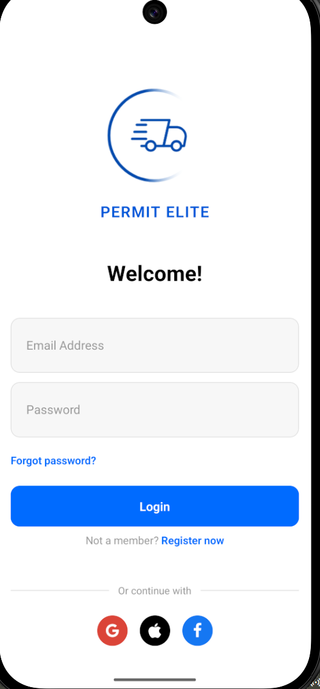
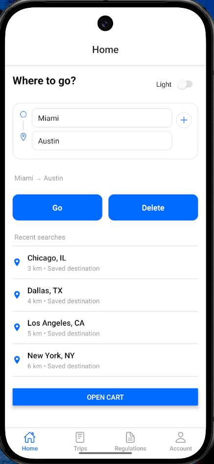
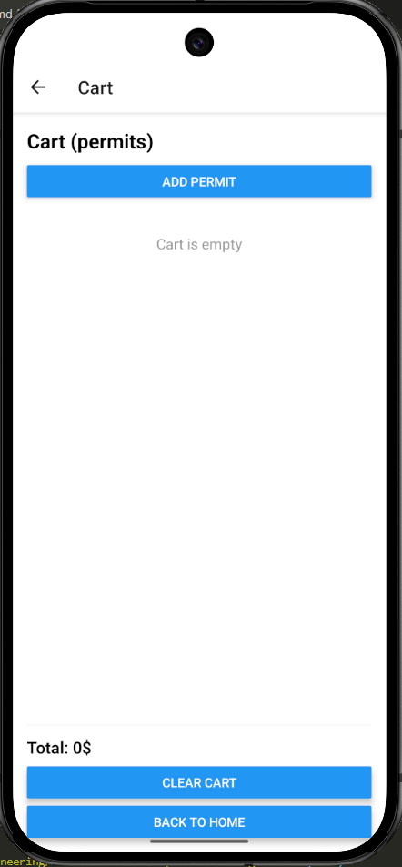
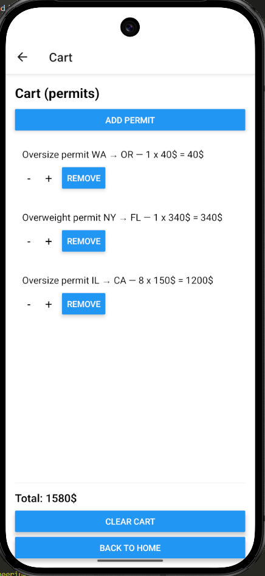
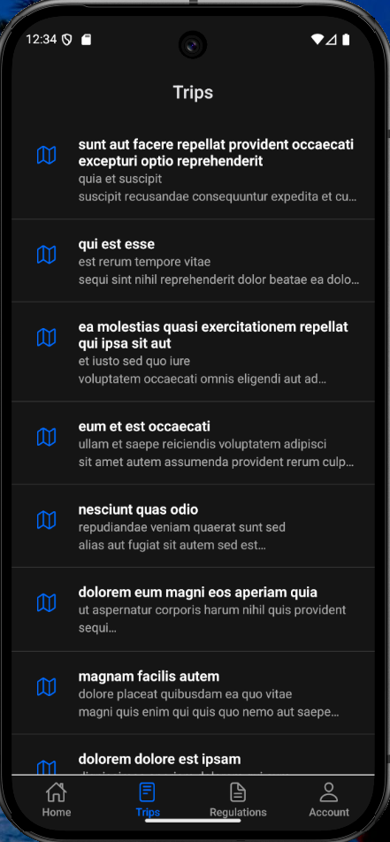
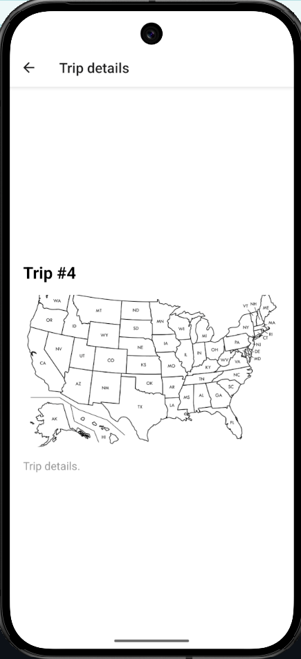
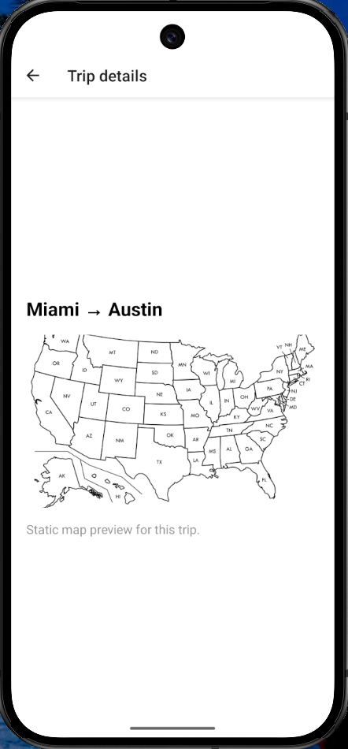
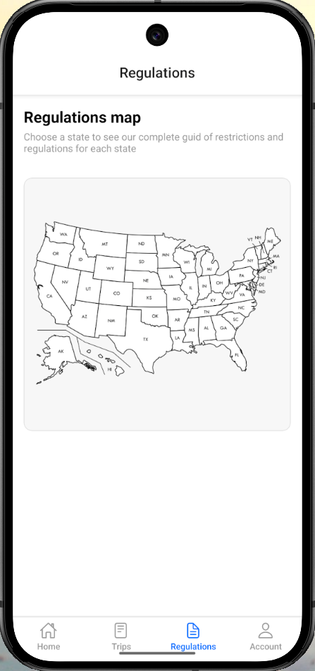
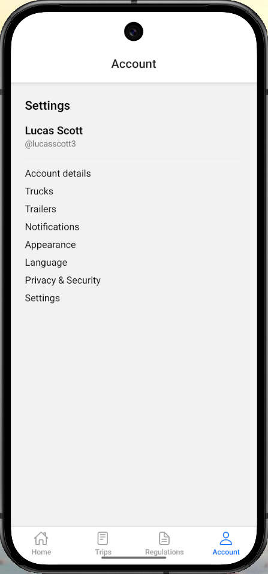
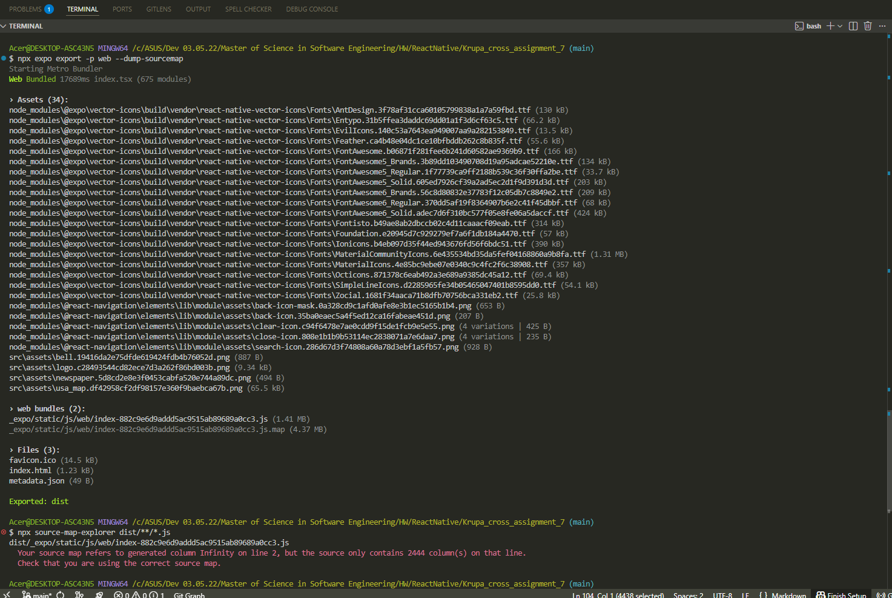

# Application for tracking oversize/overweight permits

Mobile app prototype for the _Permit Elite_ product built with React Native (Expo) and TS.  
The project focuses on navigation flows (Stack + Tabs), parameter passing, REST API integration, and styled UI components.

## Navigation structure

- **Login (Stack)** – standalone authentication screen without bottom tabs (auth logic is not implemented yet).
- **HomeTabs (Bottom Tabs)**:
  - `Home` – “Where to go?” screen with route inputs (From / optional Via / To), a theme toggle and recent locations.
  - `Trips` – list of trips loaded from a REST API; each item opens a TripDetails screen.
  - `Regulations` – US map placeholder for overweight/oversize regulations.
  - `Account` – basic account/settings placeholder.
- Navigation is defined in `src/navigation/index.tsx` and screens in `src/navigation/screens`.

## Core UI components

- `LogoHeader` – app logo and title.
- `AuthInput` – reusable styled text input.
- `PrimaryButton` – primary action button used across screens.
- `TextLink` – inline text link for secondary actions.
- `OrDivider` – divider with centered label.
- `SocialButtonRow` – social login buttons (Google / Apple / Facebook).
- `TripCard` – trip list item used in the Trips screen.
- `CartItem` – single item in the permits cart.

## API integration

The **Trips** tab now loads trip data from a public REST API instead of local mock data.  
For this purpose the app uses [JSONPlaceholder](https://jsonplaceholder.typicode.com), a free fake online REST API suitable for demos and testing.

- Endpoint: `https://jsonplaceholder.typicode.com/posts?_limit=10`
- Library: `axios` (`src/api.ts`)
- Data flow:
  - `fetchTrips` in `src/api.ts` sends a GET request and returns an array of posts.
  - `TripsScreen` (`src/navigation/screens/Updates.tsx`) calls `fetchTrips` inside `useEffect`, stores the result in local state, and handles loading and error states.
  - The data is rendered with `FlatList` using a reusable `TripCard` component; each card navigates to `TripDetails` with the selected `itemId`.

`TripDetails` displays either API-based trip details (by `itemId`) or a user-defined route passed from the Home screen, together with a static map preview image.

This demonstrates basic REST API integration, state management after the request, list rendering with `FlatList`, and navigation to a details screen with parameters.

## Home route creation

The Home screen lets the user configure a simple trip directly in the app:

- Inputs for **From**, optional **Via** and **To**.
- After filling the fields, the user sees a compact `From → Via → To` summary with **Go** and **Delete** buttons.
- **Go** opens the `TripDetails` screen with this route and shows a static map preview image.
- **Delete** clears the current route inputs.

This demonstrates parameter passing between screens and local state handling for user-defined trips.

## Global state

### Theme – Context API

App theme (light / dark) is managed via React Context API.  
`ThemeProvider` wraps the root component and exposes `theme`, `toggleTheme` and `colors` (background, text, border, card).

The **Home** screen uses a `Switch` toggle to change the theme, and the same colors are applied across screens (Login, Home, Trips, TripDetails, Cart, Regulations, Account).

### Permits cart – Redux Toolkit

The permits cart is implemented with Redux Toolkit and `react-redux`.

- `cartSlice.ts` defines `addItem`, `removeItem`, `updateQuantity` and `clearCart`.
- `store/index.ts` configures the Redux store and is connected to the app via `<Provider>`.
- `CartScreen` uses typed hooks (`useAppSelector` / `useAppDispatch`) to:
  - add random permit items;
  - change quantity with `-` / `+`;
  - remove items from the cart;
  - calculate and display the total amount at the bottom of the screen.

## Animations & Performance

- `CartScreen` uses `LayoutAnimation` (easeInEaseOut) when adding and removing permits from the cart list.
- `CartItem` was extracted into a separate file (`CartItem.tsx`) and wrapped with `React.memo`.
- `CartItem` uses `useMemo` for per‑item total price, `CartScreen` uses `useCallback` for increment/decrement/remove handlers to avoid extra re‑renders in `FlatList`.

### Cart animation

`CartScreen` uses `LayoutAnimation` (easeInEaseOut) for smooth list updates when adding and removing permits.  
The screenshots `Cart-Permits-Before.png` and `Cart-Permits-After.png` show the cart state before and after the interaction.

## Screenshots

### Login screen

### Home – Where to go (route + theme)

### Cart – Permits cart (Redux) – before

### Cart – Permits cart (Redux) – after adding items

### Trips – History (REST API)

### Trip details – API item

### Trip details – Home route map

### Regulations – Map placeholder

### Account / Settings

## Bundle analysis

- The web bundle was exported with `npx expo export -p web --dump-sourcemap`.
- `npx source-map-explorer dist/_expo/static/js/web/index-*.js` reported an issue with Expo-generated source maps ("generated column Infinity"), so a detailed breakdown was not available.
- The project does not use heavy libraries like moment or full lodash; main larger dependencies are `@react-navigation` and Redux Toolkit.
- Screenshot of the source-map-explorer output: `./screenshots/Bundle-Analysis-Error.png`.

